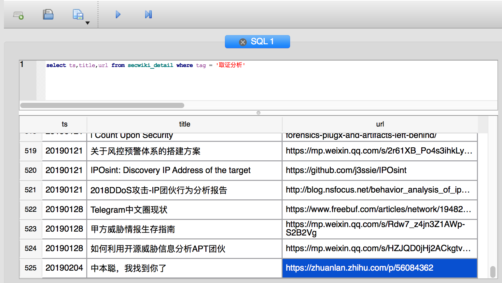

# 爬取secwiki和xuanwu.github.io的安全从业者账号

## 文章DB
[文章DB](data/scrap.db)




## 微信公众号
[微信公众号](data/weixin_sort.txt)

示例
```
微信公众号英文名 微信公众号推荐权重 微信公众号文章URL 微信公众号中文名 微信公众号ID 微信公众号简介
SecWiki 18 https://mp.weixin.qq.com/s/guVljwZyvafts-SZY_Zwow	游侠小二	SecWiki	汇集国内外优秀安全资讯、工具和网站，只做高质量聚合与评论，每天一篇优秀资讯推荐。 

```


## github
[github账号-组织](data/github.com_sort.txt_org)  

```
github_id github推荐权重 组织介绍 组织联系方式 个人介绍及联系方式 github项目URL  
hardenedlinux 8 https://github.com/hardenedlinux	This is official repository of HardenedLinux community!	Kaer Morhen https://hardenedlinux.github.io/ hardenedlinux@gmail.com	None	https://github.com/hardenedlinux/Debian-GNU-Linux-Profiles/blob/master/docs/harbian_qa/symexec/cbmc_kern.md	Hardened GNU/Linux · GitHub

```

[github账号-个人](data/github.com_sort.txt_private)

```
github_id github推荐权重 组织介绍 组织联系方式 个人介绍及联系方式 github项目URL 
tanjiti 4 https://github.com/tanjiti	None	None	#Network Security Monitor #threat intelligence  #waf #ids #iOS App Security #Android App Security #game security baidu shanghai Sign in to view email http://tanjiti.com/ https://github.com/tanjiti/packet_analysis	tanjiti (tanjiti) · GitHub


```


## twitter
[twitter账号](data/twitter_sort.txt)


```
twitter_id twitter推荐权重 twitter推文URL twitter介绍 twitter推文标题
/binitamshah 189 https://twitter.com/binitamshah/status/741235540779892738/photo/1	Linux Evangelist. Malwares. Kernel Dev. Security Enthusiast. Coffee, Jain, reformist & Philanthropist. binitamshah at protonmail dot com	Binni Shah 的 Twitter: “Drone Bypass : https://t.co/u3OM8n8XKh… ”

```

[twitter-follow-bot](https://github.com/paulfurley/twitter-follow-bot)
